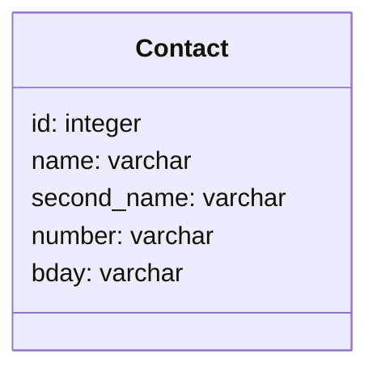

<h1>Шаблон для початку роботи зі Django проєктами</h1>
Шаблон містить шаблон, підключені статичні дані стилів (style.css), та звернення до шаблону.
Щоб завантажити необхідні модулі, виконайте команду залежності у командному рядкові:
<code>pip install -r requirements.txt</code>

